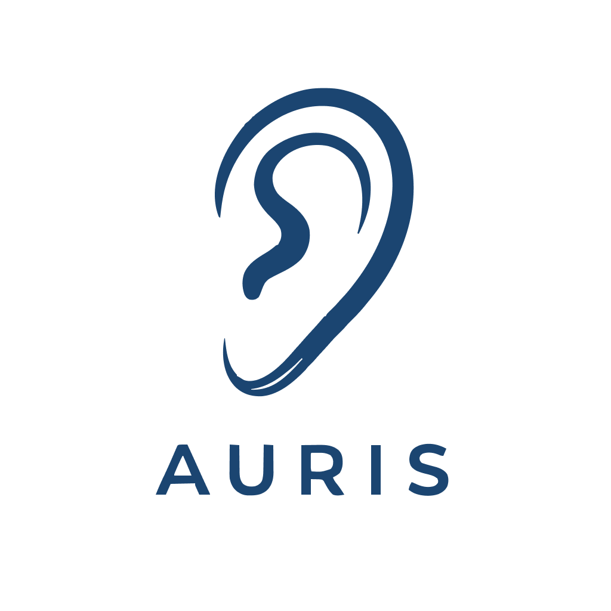

<p align="center">
  
</p>

<h1 align="center">Auris</h1>

<p align="center">
  <strong>Real-time voice transcription for Garry’s Mod servers</strong><br>
  <sub>Opus · whisper.cpp · extensible submodule API</sub>
</p>

<p align="center">
  <a href="https://github.com/ds-kimi/Auris/releases"></a>
  <a href="https://github.com/ds-kimi/Auris"></a>
  <a href="LICENSE"></a>
  
  
</p>

<br>

Captures player voice chat via an in-process `SV_BroadcastVoiceData` detour, decodes Opus audio, and transcribes it in real time using whisper.cpp. Auris is a silent platform — it does nothing by default except make transcriptions available. What happens with them is up to submodule addons.

---

## Demo Video

[](https://youtu.be/se-04PY7Yls)

Watch Auris transcribe Garry's Mod voice chat in real time.

---

## Requirements

- [Git](https://git-scm.com/)
- [Vulkan SDK](https://vulkan.lunarg.com/) 1.4.341.1 or newer *(GPU builds only)*
- [Visual Studio](https://visualstudio.microsoft.com/) with C++ build tools
- whisper.cpp model file (see "Models" below)

---

## Models

Download a `ggml-*.bin` Whisper model from:

- https://huggingface.co/ggerganov/whisper.cpp/tree/main

Place the model on your server in the Garry's Mod data folder:

- `garrysmod/data/auris/ggml-tiny.en.bin`

> **Upgrading from a previous release?** Move your model file from `data/whisper/` to `data/auris/`.

If you want to use a different model name or path, update it in:

- `garrysmod_addon/auris/lua/auris/config.lua`

---

## Building the module

See **[BUILD.md](BUILD.md)** for the full build guide — all platforms, architectures, CPU vs GPU variants, and flag reference.

**Quick start (Windows, CPU-only):**

```
RUN_ONCE.bat
premake5.exe --os=windows --gmcommon=./garrysmod_common vs2022
```

Open `projects/windows/vs2022/` and build in Release.

---

## Tested on

- Windows 11
- Vulkan SDK 1.4.341.1
- Visual Studio 18.5.11626.173

---

## Configuration

Edit `garrysmod_addon/auris/lua/auris/config.lua` to change the model path, language, thread count, and other options. Every key can also be overridden at runtime via ConVar (`auris_threads`, `auris_language`, `auris_debug`) in `server.cfg` — ConVar values take precedence over the file.

---

## Submodule API

Auris exposes a hook that any addon can listen to:

```lua
hook.Run("Auris_Transcription", ply, steamid64, text)
```

| Parameter | Type | Notes |
|---|---|---|
| `ply` | `GPlayer` or `nil` | `nil` if the player disconnected before the result arrived |
| `steamid64` | `string` | Always present |
| `text` | `string` | Transcribed speech |

### Quick start

Create a new GMod addon with one server-side file:

```lua
-- lua/autorun/server/sv_myaddon_init.lua

-- timer.Simple(0) defers until all autorun files have loaded,
-- avoiding load-order issues with Auris.
timer.Simple(0, function()
    if not Auris then
        ErrorNoHalt("[myAddon] Auris core not found\n")
        return
    end

    Auris.Subscribe("MyAddon_Feature", function(ply, steamid64, text)
        local name = IsValid(ply) and ply:Nick() or "Disconnected"
        Msg("[myAddon] " .. name .. ": " .. text .. "\n")
    end)
end)
```

### Full API reference

See [API.md](API.md) for the complete API, subscriber name conventions, version guards, and the publishing checklist to get your submodule listed here.

### Community submodules

| Addon | Description | Author |
|---|---|---|
| [auris-logger](garrysmod_addon/auris-logger/) | Prints every transcription to the server console with player name and SteamID64 | [ds-kimi](https://github.com/ds-kimi) |
| [auris-discord](garrysmod_addon/auris-discord/) | Forwards every transcription to a Discord webhook (requires [gmsv_reqwest](https://github.com/williamvenner/gmsv_reqwest)) | [ds-kimi](https://github.com/ds-kimi) |
| [auris-subtitles](garrysmod_addon/auris-subtitles/) | Displays transcriptions as animated worldspace subtitles above the speaker's head, visible to nearby players | [ds-kimi](https://github.com/ds-kimi) |

To add yours: follow the [publishing guide in API.md](API.md#publishing-your-submodule), then open a [Submit Submodule](https://github.com/ds-kimi/Auris/issues/new?template=submodule.yml) issue.

---

## Star history

<a href="https://www.star-history.com/#ds-kimi/Auris&amp;Date"></a>

See the interactive chart on **[Star History](https://www.star-history.com/)** (repo: `ds-kimi/Auris`).
